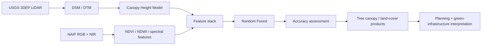

# Urban Tree-Canopy Mapping | LiDAR + NAIP + Random Forest

**LiDAR • NAIP multispectral imagery • Random Forest • point-cloud processing • feature engineering • spatial QA/QC**

An applied geospatial machine-learning project that combines **USGS 3DEP LiDAR point clouds** and **NAIP four-band imagery** to map urban tree canopy, characterize vertical structure, classify major land-cover types, and support green-infrastructure planning.

> **Portfolio note:** GitHub commit dates reflect when public code and documentation were published or maintained. They are not intended to represent the start date of the underlying analytical work.

## Why this project matters

This project demonstrates how **3D structure from LiDAR** and **spectral information from aerial imagery** can be fused into a repeatable classification workflow. It is designed to show practical capability in LiDAR preprocessing, raster generation, feature engineering, supervised machine learning, validation, QA/QC, and decision-support delivery.

## Core workflow



## Technical capabilities demonstrated

| Capability | Implementation |
|---|---|
| LiDAR processing | LAS/LAZ ingestion, ground/first-return use, DSM, DTM, CHM |
| Aerial imagery | NAIP RGB + NIR, NDVI, NDWI and spectral feature generation |
| Data fusion | structural + spectral feature stack |
| Machine learning | Random Forest classification |
| Feature engineering | RGB/NIR, vegetation indices, CHM, roughness and interaction features |
| Validation | independent test set, confusion matrix, Kappa, precision, recall, F1, cross-validation |
| QA/QC | coordinate/grid consistency, point-cloud interpretation and spatial review |
| Decision support | canopy mapping, planting-opportunity screening and urban-green-infrastructure analysis |

## Study area and data

- **Study area:** Florida International University Modesto Maidique Campus and Tamiami Park, Miami-Dade County, Florida
- **LiDAR:** USGS 3D Elevation Program (3DEP), Quality Level 2
- **Imagery:** USDA NAIP four-band RGB + NIR
- **Primary GIS environment:** ArcGIS Pro
- **Public-data reproducibility extension:** Python + `laspy` / `lazrs`

## LiDAR processing

LiDAR returns were used to derive the structural surfaces required for canopy analysis:

- **DSM:** surface elevation from first returns
- **DTM:** bare-earth elevation from ASPRS Class 2 ground returns
- **CHM:** canopy height calculated as `DSM - DTM`

A height threshold was combined with spectral vegetation information to distinguish tall woody vegetation from grass and built surfaces.

## Multispectral feature engineering

NAIP red and near-infrared bands were used to derive vegetation indices and spectral predictors. The classification feature stack included:

1. Red
2. Green
3. Blue
4. Near Infrared
5. NDVI
6. NDWI
7. Canopy Height Model
8. Canopy roughness
9. CHM × NDVI interaction

This fusion is important because spectral information alone can confuse trees with grass, while height alone can confuse trees with buildings.

## Machine learning and validation

The land-cover workflow uses a Random Forest classifier with training and validation samples distributed across the target classes. Performance assessment includes:

- confusion matrix
- overall accuracy
- Kappa coefficient
- precision
- recall
- F1 score
- cross-validation

Reported project metrics are preserved from the original analysis and should be interpreted in the context of the documented validation design.

## Decision-support value

The workflow supports:

- urban tree-canopy inventory
- canopy-gap screening
- green-infrastructure planning
- shade and heat-mitigation analysis
- stormwater and environmental planning
- long-term vegetation monitoring

The work was presented to a management team at Florida International University as an example of converting LiDAR and multispectral data into practical planning information.

## Reproducible public-data extension

This repository also includes a Python pathway for public **USGS 3DEP LAS/LAZ** ingestion:

- [`src/real_laz_ingestion.py`](src/real_laz_ingestion.py)
- [`docs/usgs_3dep_real_data.md`](docs/usgs_3dep_real_data.md)
- `laspy` and `lazrs` for point-cloud reading

The Python extension demonstrates reproducible ingestion and processing architecture. It does not claim that every original ArcGIS Pro result was produced by the Python code.

## Repository structure

```text
lidar-canopy-terrain-analysis/
├── data/
├── docs/
├── figures/
├── notebooks/
├── results/
├── scripts/
├── src/
└── tests/
```

## Production relevance

The project mirrors common geospatial production stages: **point-cloud ingestion → terrain/canopy derivation → aerial-image feature engineering → model training → validation → spatial QA/QC → final mapped deliverables**. The workflow is suitable for extension to larger aerial-mapping areas and additional object/land-cover classes.

## Limitations

The project is an applied remote-sensing assessment rather than a formal field inventory. Important limitations include single-period imagery, threshold sensitivity, potential confusion between rooftop vegetation and trees, dependence on validation-sample design, and lack of a dedicated independent GPS field campaign.

## Author

**Priyanka Belbase**  
Geospatial Data Science | Remote Sensing | GeoAI | LiDAR | Machine Learning


## Forest inventory and operational forestry extension

For a forestry-specific application of the LiDAR + multi-sensor workflow, see:

- [Forest Inventory Intelligence: technical methods and QA/QC](docs/FORESTRY_LIDAR_UAV_EXTENSION.md)
- [Reproducible Python canopy metrics, validation, change, and scouting index](src/forest_inventory_extension.py)
- [Automated unit tests](tests/test_forest_inventory_extension.py)
- [LinkedIn project description](docs/LINKEDIN_POST_FORESTRY.md)

**Data provenance:** The forestry extension is a reusable analysis module and is not a claim of newly acquired or independently field-validated timberland data. A real-site forestry case study is a separate next step.
