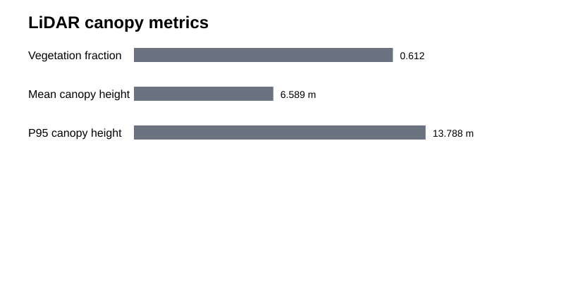
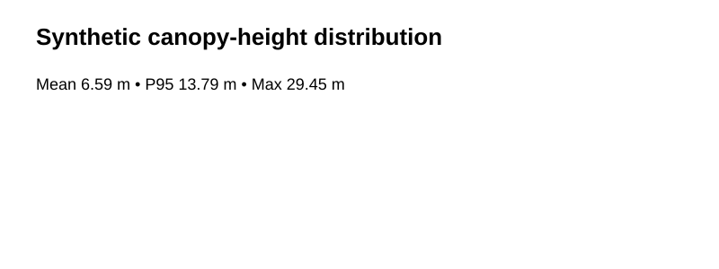

# LiDAR Canopy & Terrain Analysis

**Timeline:** Geospatial/vegetation-structure skill development **2024–2025** • Public GitHub portfolio implementation **2026**

A recruiter-ready LiDAR project covering point-cloud structure, ground normalization, canopy-height metrics, visualization, reproducible synthetic testing, and a **real USGS 3DEP LAS/LAZ ingestion pathway**.

> The committed sample point cloud is synthetic for immediate reproducibility. The repository also includes code and documentation for processing real public USGS 3DEP point-cloud files.

## Real public-data extension

**USGS 3DEP LiDAR → LAS/LAZ → class-2 ground points → height normalization → canopy metrics**

- Real LAS/LAZ reader: [`src/real_laz_ingestion.py`](src/real_laz_ingestion.py)
- USGS 3DEP download/provenance guide: [`docs/usgs_3dep_real_data.md`](docs/usgs_3dep_real_data.md)
- Uses `laspy` + `lazrs`
- Reads XYZ, ASPRS classification and return information
- Demonstrates a transparent baseline for ground normalization and vegetation-height metrics

USGS provides 3DEP point clouds through The National Map and LidarExplorer, including downloadable LAS/LAZ point-cloud products.

## Synthetic demo metrics
- Points: **6,000**
- Vegetation fraction: **61.22%**
- Mean canopy height: **6.59 m**
- 95th percentile canopy height: **13.79 m**




## Run synthetic demo
```bash
pip install -r requirements.txt
python scripts/run_demo.py
python -m pytest -q
```

## Run a real USGS 3DEP tile
```bash
python src/real_laz_ingestion.py path/to/your_tile.laz
```

## Scientific / engineering boundary

The real-data reader is an educational baseline, not a claim of production-quality LiDAR terrain modeling. Operational work should add robust PDAL/terrain processing, CRS and vertical-datum QA/QC, DTM/DSM/CHM generation, tile-edge handling, metadata capture, and independent validation.
