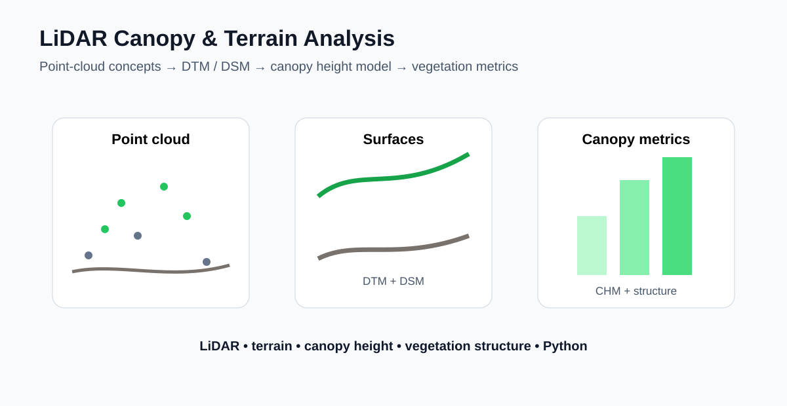

# LiDAR Canopy and Terrain Analysis



A lightweight LiDAR workflow for separating terrain and vegetation returns, generating DTM/DSM surfaces, calculating a canopy height model (CHM), and summarizing vegetation structure.

## Skills demonstrated
- LiDAR point-cloud concepts
- Ground vs vegetation returns
- Digital Terrain Model (DTM)
- Digital Surface Model (DSM)
- Canopy Height Model (CHM)
- Canopy height and cover metrics
- Spatial interpolation and visualization

## Run
```bash
pip install -r requirements.txt
python src/demo.py
pytest -q
```

## Data note
The demonstration creates a synthetic point cloud. A production version can be connected to LAS/LAZ data using tools such as PDAL or laspy and extended to tree segmentation, biomass estimation, or habitat structure analysis.

## Applications
Forestry, vegetation management, ecological monitoring, biomass studies, powerline vegetation screening, and terrain characterization.

## Author
Priyanka Belbase | LiDAR | Vegetation Monitoring | GIS | Remote Sensing
