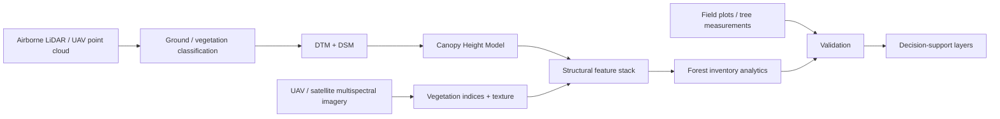

# Forest Inventory Intelligence Extension

This extension adapts the repository's LiDAR and multispectral workflow to operational forestry use cases relevant to timber inventory, UAV/LiDAR acquisition, spatial QA/QC, and decision support.

## Objective

Transform airborne LiDAR, UAV imagery, multispectral imagery, and field observations into reproducible forest-structure and inventory products that can support:

- canopy-height mapping
- forest stand structural characterization
- tree-height summaries
- canopy-cover estimation
- change detection across repeated acquisitions
- field validation
- spatial QA/QC
- scouting and inventory prioritization

## Workflow



## Core products

1. **Digital Terrain Model (DTM)** from ground-classified LiDAR returns.
2. **Digital Surface Model (DSM)** from first/highest returns.
3. **Canopy Height Model (CHM)** from DSM minus DTM.
4. **Canopy cover** using a configurable vegetation-height threshold.
5. **Tree-height distribution** and structural percentiles.
6. **Candidate treetop locations** from local maxima in the CHM.
7. **Multi-temporal canopy change** when repeated acquisitions are available.
8. **Field validation metrics** including RMSE, MAE, bias, and R².
9. **GIS-ready decision layers** for field review and management planning.

## QA/QC framework

The workflow includes checks for:

- coordinate reference system consistency
- spatial extent overlap
- raster cell-size consistency
- nodata handling
- vertical-unit assumptions
- implausible negative canopy heights
- outlier canopy heights
- missing field-plot identifiers
- duplicate records
- reproducible parameter tracking

## Operational forestry interpretation

The goal is not simply to produce a map. The workflow is structured around the question:

> Which forest areas should receive additional inventory, field verification, or management attention based on remotely sensed structural patterns?

This makes the project relevant to remote-sensing teams that use LiDAR and UAV data to support forest inventory and operational decision making.

## Example Python usage

```python
from src.forest_inventory_extension import (
    canopy_metrics,
    validation_metrics,
    build_priority_score,
)

metrics = canopy_metrics(chm_array, canopy_threshold_m=2.0)
print(metrics)

validation = validation_metrics(
    observed_height_m=field_heights,
    predicted_height_m=lidar_heights,
)
print(validation)

priority = build_priority_score(
    canopy_change_m=change,
    canopy_height_m=height,
    ndvi=ndvi,
)
```

## Important portfolio note

This extension demonstrates the analytical architecture and reproducible Python implementation for operational forestry. Results should only be described as field-validated when independent field measurements have actually been used. The repository therefore separates demonstrated code capability from claims about real-world accuracy.
